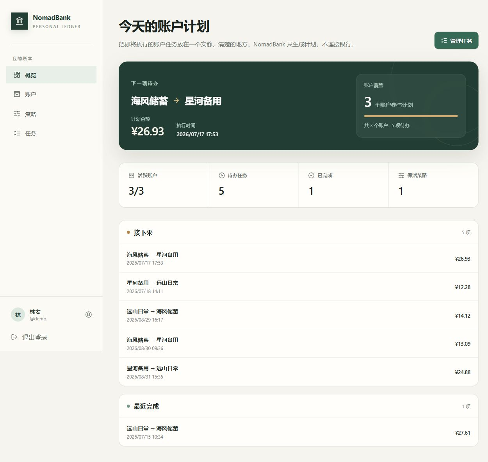

# NomadBank

[](https://github.com/CoxxA/nomadbank/actions/workflows/ci.yml)
[](https://github.com/CoxxA/nomadbank/releases/latest)
[](LICENSE)

NomadBank 是一个轻量级、单用户、自托管的银行账户保活任务助手。它根据你设置的账户和策略生成轮换计划，帮助你记住何时在自己的账户之间完成小额转账。

> NomadBank 不连接银行、不读取余额，也不会自动执行真实转账。它只保存本地计划和完成记录，所有任务都需要你自行确认并操作。



## 为什么使用 NomadBank

- 为个人部署设计，每个实例只有一个所有者
- 管理账户标签、分组、保活策略和任务批次
- 自动生成平衡的转入/转出计划，并手动记录完成状态
- Go 单文件程序内嵌 React 前端和时区数据
- SQLite 本地存储，不需要外部数据库、Redis 或消息队列
- 提供固定版本的 Docker 镜像和跨平台发布包

## Docker Compose 快速开始

需要安装 [Git](https://git-scm.com/downloads) 和 [Docker Desktop](https://docs.docker.com/desktop/)，或安装 Git、Docker Engine 与 Compose 插件。

```bash
git clone https://github.com/CoxxA/nomadbank.git
cd nomadbank
cp .env.example .env
docker compose pull
docker compose up -d
```

Windows PowerShell 请把第三行改为：

```powershell
Copy-Item .env.example .env
```

打开 <http://localhost:8080>，创建所有者账户即可开始。`.env.example` 已固定到正式发布版本；升级前请先阅读[部署指南](docs/deployment.md)和[备份与恢复](docs/backup-restore.md)。

## 使用流程

1. 首次启动时创建唯一的所有者账户。
2. 添加至少两个需要维护的银行账户标签。
3. 使用默认策略，或配置间隔、时间、金额和每日上限。
4. 选择策略、账户分组和周期数生成任务批次。
5. 实际完成转账后，在任务页手动标记完成。

## 数据与安全

数据、密码哈希和会话都保存在部署实例的 SQLite 数据目录中。请保护该目录、定期离线备份，并通过 HTTPS 暴露公网实例。不要在 NomadBank 中保存银行卡号、网银密码、短信验证码或其他银行凭据。

- [部署与配置](docs/deployment.md)
- [备份与恢复](docs/backup-restore.md)
- [升级说明](docs/upgrading.md)
- [安全策略](SECURITY.md)

## 开发与维护

- [本地开发](docs/development.md)
- [架构说明](docs/architecture.md)
- [OpenAPI 规范](docs/api/openapi.yaml)
- [贡献指南](CONTRIBUTING.md)
- [维护与发布](docs/releasing.md)

遇到问题时请先阅读[支持指南](SUPPORT.md)。Bug 和功能建议使用 GitHub Issues；安全漏洞请通过 [GitHub Security Advisories](https://github.com/CoxxA/nomadbank/security/advisories/new) 私下报告。

## License

[MIT](LICENSE)
